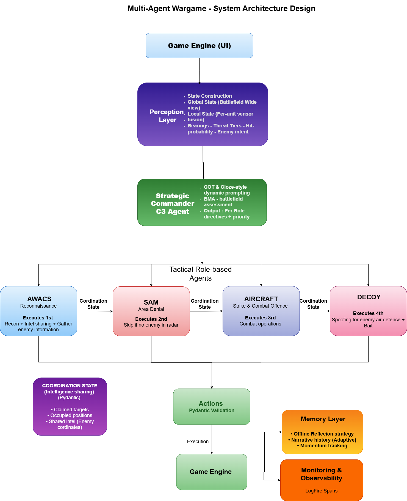

# 2D War Game — Agentic AI Combat Simulator

Turn-based air combat simulation with a FastAPI backend, HTML/JS UI, and a **hierarchical multi-agent LLM AI** opponent.
Human (Blue) vs LLM Agent (Red) — powered by OpenRouter.

---

## Quick Start

### Requirements
- Python ≥ 3.12
- [`uv`](https://github.com/astral-sh/uv) package manager

### Setup & Run
```bash
# 1. Install uv (once)
pip install uv

# 2. Install dependencies
uv sync

# 3. Set environment variables (copy and edit)
copy .env.example .env   # or create .env manually

# 4. Launch backend + UI
uv run python main.py
```

### Arhcitecture Design


The server starts at `http://127.0.0.1:8000` and auto-opens the browser.  
Logs go to stdout and `storage/logs/backend.log`.

### Environment Variables
```bash
# .env file
OPENROUTER_API_KEY=your_key_here      # Required — get from openrouter.ai

# Optional (Logfire observability)
LOGFIRE_TOKEN=your_logfire_token
LOGFIRE_CONSOLE=true
ENV=development
```

### How to Play
1. Open `http://localhost:8000` in your browser
2. Click **"Use Default Scenario (Human vs LLM Agent)"** in the sidebar
3. Click **"▶ Launch Scenario"** in the header
4. On your turn: select actions for each Blue unit from the sidebar dropdowns
5. Click **"Submit Actions & End Turn"** — the LLM Agent responds as Red

---

## Architecture

### Module Map
```
wargame2d/
├── main.py               # Entry point — launches uvicorn + opens browser
├── api/app.py            # FastAPI routes (/start, /step, /status, ...)
├── env/                  # Game engine
│   ├── core/types.py     # Team, EntityKind, Action, etc.
│   ├── mechanics/        # Combat, movement, radar, SAM logic
│   ├── scenario.py       # Scenario definition & default scenario
│   └── world.py          # World state
├── agents/
│   ├── __init__.py       # Public API + agent registry
│   ├── random_agent/     # Random action fallback
│   ├── human_agent/      # Receives human actions from UI
│   └── agentic_agent/    # ← LLM-powered AI (see below)
├── ui/ops_deck.html      # Single-page HTML/JS frontend
├── infra/logger.py       # Logging setup
└── storage/logs/         # Runtime logs
```

---

## Agentic Agent (LLM AI Opponent)

### Overview
A **two-tier hierarchical AI** using LLMs (via OpenRouter) for both strategic and tactical decisions:

```
Game Engine
    ↓
LLMAgentV2  (main orchestrator)
    ├─ Strategic Commander  → 1 LLM call/turn  (high-level planning)
    └─ Tactical Executor    → up to 4 LLM calls/turn  (per-role actions)
           ├─ AWACS   (Intel — executes first, shares radar coverage)
           ├─ SAM     (Defense — uses AWACS intel, shares threat zones)
           ├─ AIRCRAFT (Offense — consumes all intel, performs strikes)
           └─ DECOY   (Screening — executes last, baiting/positioning)
```

### Turn Workflow (5 Stages)
| # | Stage | What Happens |
|---|-------|-------------|
| 1 | **State Construction** | Build `GlobalState` (strategic) + `LocalState` per unit; update enemy memory |
| 2 | **Strategic Planning** | LLM produces `StrategicPlan`: priorities, directives per role, situation analysis |
| 3 | **Tactical Execution** | Each role in order: build prompt → call LLM → map decisions → share intel |
| 4 | **Memory Update** | Record outcome, calculate momentum (−1.0 to +1.0), update narrative history |
| 5 | **Metadata** | Package display data for UI (situation text, force composition, reasoning per unit) |

### Key Design Decisions

**Cognitive Load Reduction for LLM:**
- Bearings over coordinates: *"Enemy NE, 10 cells"* instead of *(12, 8)*
- Threat levels: `CRITICAL / HIGH / MEDIUM / LOW / SAFE`
- Pre-calculated hit probabilities and `can_they_hit_me` boolean flags

**Cost Optimization:**
- Skip LLM if no enemies visible (use rule-based centering move) — saves ~25% tokens
- AIRCRAFT / DECOY always call LLM (complex positioning decisions needed)
- Dual-model support: larger strategic model, faster tactical model

**Memory & Momentum:**
```python
momentum = (kills - losses) / max(kills + losses, 1)  # Range −1.0 to +1.0
```
Tracks `recent_plans` (last 3), `recent_outcomes` (last 3), `narrative_history` (last 10 events), missing enemy positions.

**Performance per turn:**
- ~2–3 seconds total (85% LLM API time)
- 5 LLM calls / turn (1 strategic + 4 tactical)
- ~3,000–4,000 tokens / turn

### Configuration
```python
# In scenario.py or agent init
LLMAgentV2(
    team=Team.RED,
    strategic_model="google/gemini-2.5-flash",  # Any OpenRouter model
    tactical_model="google/gemini-2.5-flash",
    openrouter_key=os.getenv("OPENROUTER_API_KEY"),
    enable_memory=True,
)
```

---

## Creating a Custom Agent

```python
# agents/my_agent/__init__.py
from agents import BaseAgent, register_agent
from env.core.types import Team

@register_agent("my_agent")
class MyAgent(BaseAgent):
    def __init__(self, team: Team, **kwargs):
        super().__init__(team, name="MyAgent")

    def get_actions(self, state, step_info=None, **kwargs):
        # Return (actions_dict, metadata_dict)
        return {}, {}
```

Use via scenario: `AgentSpec(type="my_agent", team=Team.BLUE, init_params={})`.  
Registry auto-discovers agent modules — no manual imports needed.

---

## Observability (Logfire)

```bash
# Set LOGFIRE_TOKEN in .env to enable cloud traces
# View at: https://logfire.pydantic.dev/
```

Tracked spans: `agent_turn`, `strategic_planning`, `tactical_awacs`, `tactical_sam`, `tactical_aircraft`, `tactical_decoy`, `fallback`.

---

## Useful Links
- [OpenRouter](https://openrouter.ai/docs) — LLM API gateway
- [Pydantic](https://docs.pydantic.dev/) — Data validation
- [Logfire](https://logfire.pydantic.dev/docs/) — Observability
- [FastAPI](https://fastapi.tiangolo.com/) — Backend framework